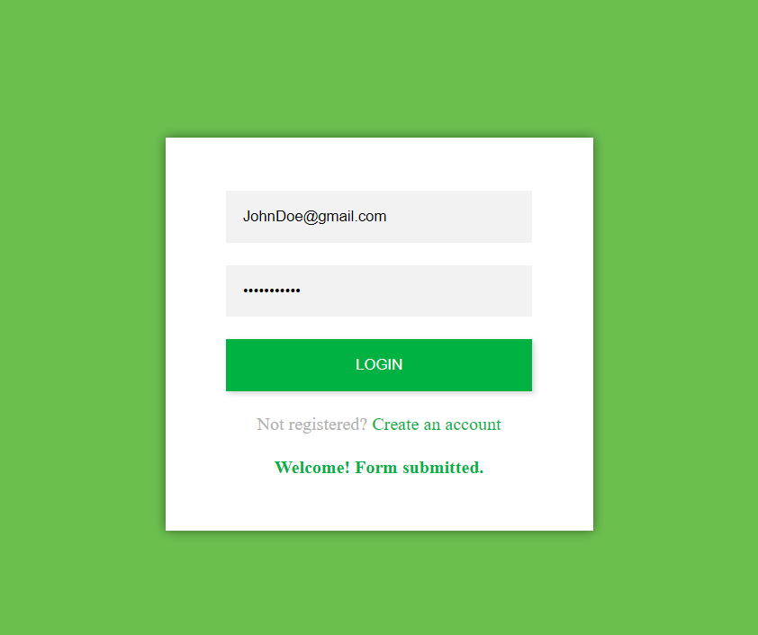

# LOGIN PAGE

# My Project

Welcome to my project! You can check out the live website [here](https://fatmaelzahraaahmed.github.io/JSBasicLoginPage/).

## Overview

This code provides a simple login page implemented using HTML, CSS, and JavaScript. The page includes input fields for a username and password, a login button, and a link to create a new account. The login functionality is currently basic, with hardcoded credentials for demonstration purposes.

## File Structure

- index.html: This file contains the structure of the login page, including the HTML elements for username and password input, the login button, and the link to create an account. It also links to external styles and scripts.

- styles/style.css: The CSS file contains styles for the login page. It is linked to the HTML file to define the visual appearance of the elements.

- scripts/script.js: The JavaScript file handles the login functionality. It retrieves the input values, validates them, and displays a message based on the login result.

## Functionality

The login and registration functionalities are implemented in the `script.js` file. When the user clicks the "LOGIN" button, the script retrieves the entered username and password, checks if the provided credentials match the hardcoded values, and displays a corresponding message. Similarly, the registration process validates the entered email and password, showing success or error messages accordingly.

## Usage

To use this login page:

1. Clone or download the repository.
2. Open the index.html file in a web browser to view and interact with the login page.
3. Modify the code as needed to suit your application's requirements.
4. Integrate the frontend with your backend authentication system for a complete login solution.

## Important Note

This code is intended for educational purposes and serves as a starting point for a basic login page. For a production environment, consider implementing more secure authentication mechanisms, such as token-based authentication and server-side validation.
